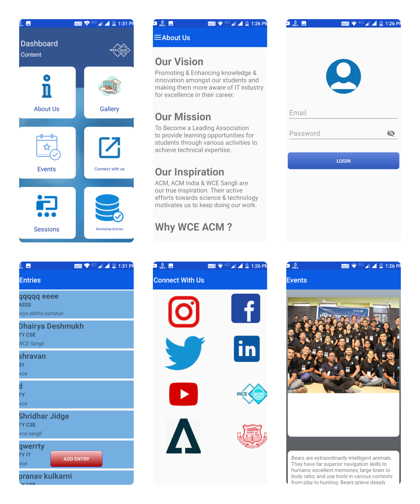

# WceAcmApplication-
This is an application for WCE ACM Student chapter. This app contains information about the community, community members, the events held by club and sessions conducted by members for students in college. This app is also useful for collection of entries of an event.

Below are the screenshots of app:

